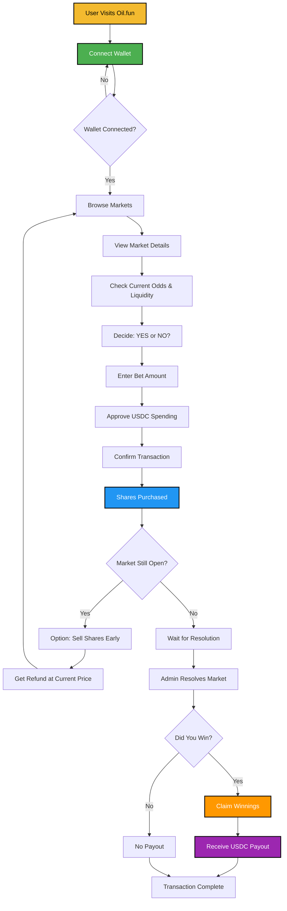

# 🛢️ Oil.fun - Decentralized Energy Prediction Markets

<div align="center">


**Built for BNB Chain Hackathon**

A decentralized prediction market platform for energy markets, enabling users to bet on oil prices, OPEC decisions, natural gas trends, and more.

[Live Demo](#) • [Documentation](#) • [Smart Contract](#)

</div>

---

## 📋 Table of Contents

- [Overview](#-overview)
- [Features](#-features)
- [Tech Stack & Integrations](#-tech-stack--integrations)
- [User Journey](#-user-journey)
- [Smart Contract](#-smart-contract)
- [Deployment](#-deployment)
- [Getting Started](#-getting-started)
- [Project Structure](#-project-structure)
- [Contributing](#-contributing)

---

## 🎯 Overview

**Oil.fun** is a decentralized prediction market platform built on BNB Chain that allows users to trade on the outcomes of energy market events. Whether you're predicting crude oil prices, OPEC production decisions, natural gas trends, or energy ETF performance, Oil.fun provides a transparent, decentralized marketplace powered by smart contracts.

### Key Highlights

- 🎲 **Dynamic AMM-based Pricing**: Share prices adjust automatically based on pool liquidity
- 💰 **USDC-denominated**: All bets and payouts in USDC for stable value
- 🔒 **Fully Decentralized**: Smart contracts on BNB Chain ensure trustless operation
- 📊 **Real-time Oracle Feeds**: Integrated with APRO Oracle for live market data
- 🎨 **Modern UI/UX**: Beautiful, responsive interface built with Next.js and Tailwind CSS
- 🔐 **Multi-wallet Support**: Connect with MetaMask, Rabby, or WalletConnect

### How It Works

1. **Market Creation**: Administrators create prediction markets with specific questions and end dates
2. **Dynamic Pricing**: Share prices are calculated as `Opposite Side Stake / Total Stake`
3. **Betting**: Users buy shares on YES or NO outcomes using USDC
4. **Early Advantage**: Betting on the underdog (lower liquidity side) gives you more shares
5. **Resolution**: Markets are resolved by administrators after the event date
6. **Payouts**: Winners receive proportional payouts based on their share ownership

---

## ✨ Features

### Core Functionality

- ✅ **Create Prediction Markets**: Admin-only market creation with custom questions
- ✅ **Buy/Sell Shares**: Trade shares on market outcomes with dynamic pricing
- ✅ **Real-time Market Data**: Live updates on pool liquidity, prices, and volumes
- ✅ **Oracle Price Feeds**: Real-time cryptocurrency prices via APRO Oracle
- ✅ **Wallet Integration**: Seamless connection with popular Web3 wallets
- ✅ **Market Categories**: Organized markets by category (Crude Oil, Natural Gas, OPEC, ETFs)
- ✅ **Claim Winnings**: One-click claiming of rewards after market resolution

### User Experience

- 🎨 **Dark/Light Theme**: Beautiful UI with theme switching
- 📱 **Responsive Design**: Works seamlessly on desktop and mobile
- ⚡ **Fast Performance**: Optimized with Next.js and Turbo
- 🔔 **Real-time Updates**: Live market data and price feeds

---

## 🔌 Tech Stack & Integrations

### Blockchain & Web3

| Technology | Purpose | Version |
|------------|---------|---------|
| **BNB Chain (BSC)** | Main blockchain network | Mainnet |
| **Wagmi** | React hooks for Ethereum/BNB Chain | ^2.19.5 |
| **RainbowKit** | Wallet connection UI | ^2.2.9 |
| **Viem** | TypeScript Ethereum library | ^2.41.2 |
| **USDC** | Payment token (BSC) | 0x8AC76a51cc950d9822D68b83fE1Ad97B32Cd580d |

### Smart Contracts

| Component | Description |
|-----------|-------------|
| **PredictionMarketAMM.sol** | Main prediction market contract with AMM pricing |
| **OpenZeppelin** | Security libraries (ReentrancyGuard, SafeERC20) |
| **Solidity** | ^0.8.19 |

### Frontend

| Technology | Purpose |
|------------|---------|
| **Next.js** | React framework with SSR | 16.0.7 |
| **TypeScript** | Type-safe development |
| **Tailwind CSS** | Utility-first CSS framework |
| **Radix UI** | Accessible component primitives |
| **React Query** | Data fetching and caching |
| **Lucide React** | Icon library |

### External Services

| Service | Purpose |
|---------|---------|
| **APRO Oracle** | Real-time cryptocurrency price feeds (BTC, ETH, BNB) |
| **Vercel** | Frontend hosting and deployment |
| **WalletConnect** | Multi-wallet connection protocol |

### Supported Wallets

- 🔷 **MetaMask**
- 🦝 **Rabby Wallet**
- 🔗 **WalletConnect** (all compatible wallets)

---

## 🗺️ User Journey



### Journey Steps Explained

1. **Connect Wallet** → User connects their Web3 wallet (MetaMask, Rabby, etc.)
2. **Browse Markets** → Explore available prediction markets by category
3. **View Details** → Check current odds, liquidity pools, and market end date
4. **Place Bet** → Choose YES or NO, enter amount, approve and confirm transaction
5. **Manage Position** → Optionally sell shares early if market conditions change
6. **Market Resolution** → Admin resolves market after event date
7. **Claim Winnings** → Winners claim their proportional share of the pool
8. **Receive Payout** → USDC transferred directly to wallet

---

## 📜 Smart Contract

### PredictionMarketAMM Contract

The core smart contract implements an AMM (Automated Market Maker) model for prediction markets.

**Key Features:**
- Dynamic share pricing based on pool liquidity
- Buy/sell shares before market closes
- Proportional payout distribution to winners
- Reentrancy protection and security best practices

**Contract Address:** `[To be deployed]`

**Network:** BNB Chain (BSC) Mainnet

**Key Functions:**
- `createQuestion()` - Create new prediction market (admin only)
- `buyShares()` - Purchase shares on YES or NO outcome
- `sellShares()` - Sell shares back to pool before market closes
- `resolveMarket()` - Resolve market with outcome (admin only)
- `claimWinnings()` - Claim proportional payout after resolution

**Security:**
- ✅ OpenZeppelin ReentrancyGuard
- ✅ SafeERC20 for token transfers
- ✅ Custom error handling (gas efficient)
- ✅ Access control for admin functions

---

## 🚀 Deployment

### Frontend Deployment

**Platform:** Vercel

**Status:** ✅ Deployed

**Live URL:** [Your Vercel deployment URL]

**Environment Variables Required:**
```env
NEXT_PUBLIC_WALLETCONNECT_PROJECT_ID=your_project_id
APRO_API_KEY=your_apro_api_key
APRO_API_SECRET=your_apro_api_secret
```

### Smart Contract Deployment

**Network:** BNB Chain (BSC) Mainnet

**Contract Address:** `[To be deployed]`

**Deployment Steps:**
1. Compile contract: `npx hardhat compile`
2. Deploy to BSC: `npx hardhat run scripts/deploy.js --network bsc`
3. Verify contract: `npx hardhat verify --network bsc <CONTRACT_ADDRESS>`

**Verification:**
- [ ] Contract verified on BSCScan
- [ ] Contract address updated in frontend
- [ ] USDC token address configured

### Build & Run Locally

```bash
# Install dependencies
npm install

# Run development server
npm run dev

# Build for production
npm run build

# Start production server
npm start
```

---

## 🏗️ Getting Started

### Prerequisites

- Node.js 18+ and npm/pnpm
- MetaMask or compatible Web3 wallet
- BNB for gas fees
- USDC on BNB Chain for betting

### Installation

```bash
# Clone the repository
git clone https://github.com/yourusername/oilfun.git
cd oilfun

# Install dependencies
npm install
# or
pnpm install

# Set up environment variables
cp .env.example .env.local
# Edit .env.local with your API keys

# Run development server
npm run dev
```

Open [http://localhost:3000](http://localhost:3000) in your browser.

### Configuration

1. **WalletConnect Project ID**: Get from [WalletConnect Cloud](https://cloud.walletconnect.com)
2. **APRO Oracle API**: Sign up at [APRO Oracle](https://apro.com) for API credentials
3. **Contract Address**: Update contract address in frontend after deployment

---

## 📁 Project Structure

```
oilfun/
├── app/                    # Next.js app directory
│   ├── api/               # API routes
│   │   └── oracle/        # Oracle price feed endpoint
│   ├── layout.tsx         # Root layout
│   └── page.tsx           # Home page
├── components/            # React components
│   ├── ui/                # Reusable UI components
│   ├── betting-modal.tsx  # Betting interface
│   ├── market-card.tsx    # Market card component
│   ├── market-grid.tsx    # Market grid layout
│   ├── oracle-feed.tsx    # Oracle price feed display
│   └── wallet-modal.tsx   # Wallet connection modal
├── contracts/             # Smart contracts
│   └── PredictionMarket.sol
├── lib/                   # Utility functions
│   └── utils.ts
├── public/                # Static assets
└── styles/                # Global styles
```

---

## 🤝 Contributing

Contributions are welcome! Please feel free to submit a Pull Request.

1. Fork the repository
2. Create your feature branch (`git checkout -b feature/AmazingFeature`)
3. Commit your changes (`git commit -m 'Add some AmazingFeature'`)
4. Push to the branch (`git push origin feature/AmazingFeature`)
5. Open a Pull Request

---

## 📄 License

This project is licensed under the MIT License - see the LICENSE file for details.

---

## 🙏 Acknowledgments

- **BNB Chain** for the blockchain infrastructure
- **APRO Oracle** for reliable price feeds
- **OpenZeppelin** for security best practices
- **RainbowKit** for excellent wallet integration
- **Vercel** for seamless deployment

---

<div align="center">

**Built with ❤️ for the BNB Chain Hackathon**

[Report Bug](https://github.com/yourusername/oilfun/issues) • [Request Feature](https://github.com/yourusername/oilfun/issues) • [Documentation](#)

</div>
